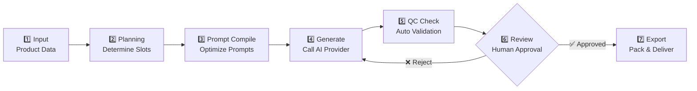

# 🛒 E-commerce AI Image Generation Platform


<p align="center">
  <strong>A production-grade AI-powered platform for batch-generating e-commerce product images with quality control and multi-platform export</strong>
</p>

<p align="center">
  <a href="#-features">Features</a> •
  <a href="#-tech-stack">Tech Stack</a> •
  <a href="#-getting-started">Getting Started</a> •
  <a href="#-project-structure">Project Structure</a> •
  <a href="#-architecture">Architecture</a> •
  <a href="#-screenshots">Screenshots</a> •
  <a href="#-contributing">Contributing</a>
</p>

---

## 🎯 Overview

**E-commerce AI Image Generation Platform** is a comprehensive, production-ready system designed for e-commerce teams and agencies to **batch-generate, quality-check, review, and export product images** across multiple platforms.

Unlike simple AI image generators, this platform provides a **complete workflow** from product input to deliverable image packs:

```
Product Input → Platform Rules → Bundle Planning → Image Generation → QC → Review → Export
```

### ✨ Key Differentiators

- **🌐 Platform-Aware**: Automatically adapts to requirements of Amazon, eBay, Shopify, Taobao, JD, TikTok Shop, and more (10+ platforms)
- **📦 Batch Processing**: Generate hundreds of images for multiple SKUs across multiple platforms simultaneously
- **✅ Quality Assurance**: Built-in automated quality control with consistency scoring, style validation, and compliance checking
- **🎨 Brand Consistency**: Brand packs and series asset packs ensure visual consistency across all generated images
- **📤 Production-Ready Export**: Export properly named, structured image packs ready for platform upload

## 🌟 Features

### Core Workflow

| Feature | Description |
|---------|-------------|
| **🏢 Workspace Management** | Multi-workspace support for agencies managing multiple clients |
| **🎨 Brand Asset Management** | Define brand colors, fonts, tone, and visual boundaries |
| **📑 Series Templates** | Reusable style templates that maintain consistency across product lines |
| **📦 Product Library** | Comprehensive product data management with attributes, selling points, and reference images |
| **🗺️ Bundle Planning** | Intelligent planning of image slots per platform (main image, feature, scene, comparison, etc.) |
| **⚡ Batch Generation** | Queue-based batch image generation with automatic retry mechanisms |
| **🔍 Automated QC** | AI-powered quality control checking consistency, style adherence, and platform compliance |
| **✅ Review System** | Human-in-the-loop review workflow with approve/reject/retry actions |
| **📤 Export System** | Structured export with proper naming conventions, manifests, and delivery notes |

### Supported Platforms

**China (国内):**
- 🟠 Taobao / Tmall (淘宝/天猫)
- 🔵 JD.com (京东)
- 🔴 Pinduoduo (拼多多)
- ⚫ Douyin (抖音电商)

**Global (国际):**
- 🟡 Amazon (亚马逊)
- 🟣 eBay
- 🟠 Etsy
- 💚 Shopify
- 🔵 TikTok Shop
- 🔴 AliExpress (速卖通)

### Commercial & Enterprise Features

- 💳 Subscription plans with credit-based usage system
- 🔑 API access with key management and rate limiting
- 👥 Team collaboration with role-based permissions
- 📊 Usage tracking and quota management
- 🔌 Plugin system for extensibility
- 📈 Performance feedback loop

## 🛠️ Tech Stack

| Category | Technology | Version |
|----------|------------|---------|
| **Framework** | [Next.js](https://nextjs.org) (App Router) | 16.x |
| **Language** | TypeScript | 5.x |
| **UI Library** | React | 19.x |
| **Styling** | [Tailwind CSS](https://tailwindcss.com) + [shadcn/ui](https://ui.shadcn.com) | 4.x |
| **Database** | SQLite via [Prisma ORM](https://www.prisma.io) | 7.x |
| **AI/ML** | [OpenAI API](https://openai.com) (DALL-E 3) | 6.x |
| **Validation** | [Zod](https://zod.dev) | 4.x |
| **Testing** | [Vitest](https://vitest.dev) | 4.x |
| **Auth** | Custom session-based auth with bcrypt | - |

## 🚀 Getting Started

### Prerequisites

Ensure you have the following installed:

- **Node.js** >= 18.x ([Download](https://nodejs.org/))
- **npm** >= 9.x (comes with Node.js) or **yarn** or **pnpm**
- **Git** ([Download](https://git-scm.com/))
- An **OpenAI API key** (get one at [platform.openai.com](https://platform.openai.com/api-keys))

### Quick Start (5 minutes)

```bash
# 1. Clone the repository
git clone https://github.com/YOUR_USERNAME/e-commerce-ai-image-platform.git

# 2. Navigate to project directory
cd e-commerce-ai-image-platform

# 3. Install dependencies
npm install

# 4. Set up environment variables
cp .env.example .env
# Edit .env file and add your OpenAI API key:
# OPENAI_API_KEY=sk-your-actual-key-here

# 5. Initialize database (runs migrations + seeds data)
npx prisma migrate dev --name init
npx prisma db seed

# 6. Start development server
npm run dev
```

**🎉 Open [http://localhost:3000](http://localhost:3000) in your browser!**

> **Note**: First-time users will be redirected to `/register` to create an account.

### Environment Variables

Create a `.env` file in the project root based on [.env.example](.env.example):

```env
# ===========================================
# Database Configuration
# ===========================================
# SQLite database path (default: local dev.db)
DATABASE_URL="file:./dev.db"

# ===========================================
# AI Provider Configuration
# ===========================================
# Required: Your OpenAI API key for DALL-E 3 image generation
OPENAI_API_KEY=sk-your-openai-key-here

# Optional: Alternative API provider (e.g., Apimart, OpenRouter, etc.)
APIMART_API_KEY=sk-your-apimart-key-here

# ===========================================
# Application Settings
# ===========================================
# Environment mode: development | production
NODE_ENV=development
```

### Available Commands

```bash
# Development
npm run dev          # Start development server (http://localhost:3000)

# Building & Production
npm run build        # Build optimized production bundle
npm start            # Start production server

# Code Quality
npm run lint         # Run ESLint checks

# Testing
npm test             # Run all tests once
npm run test:watch   # Run tests in watch mode (for development)

# Database Operations
npx prisma studio    # Open Prisma database GUI browser
npx prisma migrate dev  # Create new migration
npx prisma db seed       # Re-seed database with sample data
npx prisma db push       # Push schema changes directly (dev only)
```

## 📁 Project Structure

```
e-commerce-ai-image-platform/
│
├── 📂 src/                        # Source code
│   ├── 📂 app/                    # Next.js App Router
│   │   ├── 📂 admin/             # Admin panel (channels, plans, plugins, providers)
│   │   ├── 📂 api/               # REST API routes
│   │   │   ├── 📂 auth/          # Authentication (login, register, session)
│   │   │   ├── 📂 projects/      # Project CRUD & operations
│   │   │   ├── 📂 products/      # Product management endpoints
│   │   │   ├── 📂 tasks/         # Generation task management
│   │   │   └── 📂 v1/            # External versioned API
│   │   ├── 📂 dashboard/         # Main dashboard page
│   │   ├── 📂 projects/          # Project pages (generate, plan, qc, review, export)
│   │   ├── 📂 products/          # Product library pages
│   │   └── 📂 workspaces/        # Workspace settings & team management
│   │
│   ├── 📂 auth/                  # Authentication & authorization layer
│   │   ├── session.ts            # Session cookie management
│   │   ├── password.ts           # Password hashing (bcryptjs)
│   │   └── permissions.ts        # Role-based access control
│   │
│   ├── 📂 commerce/              # Business logic & monetization
│   │   ├── billing-service.ts    # Payment processing
│   │   ├── plan-service.ts       # Subscription plan management
│   │   └── quota-engine.ts       # Credit/quota calculation engine
│   │
│   ├── 📂 components/            # Reusable UI components
│   │   └── 📂 ui/               # shadcn/ui base components (Button, Card, etc.)
│   │
│   ├── 📂 control/               # Quality & process control systems
│   │   ├── qc-engine.ts          # Automated quality control engine
│   │   ├── review-service.ts     # Human review workflow
│   │   └── retry-engine.ts       # Automatic retry with exponential backoff
│   │
│   ├── 📂 delivery/              # Export & delivery subsystem
│   │   ├── export-builder.ts     # ZIP/pack builder with manifest
│   │   └── naming-mapper.ts      # Platform-specific file naming conventions
│   │
│   ├── 📂 ecosystem/             # External integrations & extensions
│   │   ├── api-auth-middleware.ts # API key authentication
│   │   ├── plugin-registry.ts    # Plugin system registry
│   │   └── template-service.ts   # Template management service
│   │
│   ├── 📂 generation/             # AI image generation core
│   │   ├── prompt-compiler.ts    # Prompt engineering & compilation
│   │   ├── provider-registry.ts  # Multi-provider abstraction layer
│   │   ├── batch-orchestrator.ts # Batch job orchestration
│   │   └── task-orchestrator.ts  # Task queue management
│   │
│   ├── 📂 lib/                   # Utility functions & helpers
│   │   ├── prisma.ts            # Database client initialization
│   │   └── utils.ts            # Common utilities
│   │
│   ├── 📂 planning/              # Intelligent planning module
│   │   ├── bundle-planner.ts    # Image slot planning algorithm
│   │   └── slot-mapper.ts       # Platform-to-slot mapping
│   │
│   ├── 📂 rules/                 # Platform rules engine
│   │   ├── platform-rule-registry.ts  # Rule definitions & validation
│   │   └── compliance-rules.ts       # Compliance checking logic
│   │
│   └── 📂 types/                 # TypeScript type definitions
│       ├── enums.ts            # Enumerations
│       └── models.ts           # Data model interfaces
│
├── 📂 prisma/                    # Database schema & migrations
│   ├── schema.prisma            # Complete database schema definition
│   ├── seed.ts                  # Database seeding script (sample data)
│   └── 📂 migrations/           # Schema migration files
│
├── 📂 docs/screenshots/          # Project screenshots (add yours!)
├── 📄 README.md                 # This file
├── 📄 LICENSE                   # MIT License
├── 📄 .env.example              # Environment variable template
├── 📄 .gitignore                # Git ignore rules
├── 📄 package.json              # Dependencies & scripts
├── 📄 tsconfig.json             # TypeScript configuration
├── 📄 next.config.ts            # Next.js configuration
└── 📄 prisma.config.ts          # Prisma configuration
```

## 🏗️ Architecture

### High-Level System Architecture

```
┌─────────────────────────────────────────────────────────────────────┐
│                         PRESENTATION LAYER                          │
│  ┌─────────────┐  ┌─────────────┐  ┌─────────────┐  ┌───────────┐  │
│  │  Dashboard  │  │  Products   │  │  Projects   │  │   Admin   │  │
│  │             │  │  Library    │  │  Workspace  │  │  Panel    │  │
│  └──────┬──────┘  └──────┬──────┘  └──────┬──────┘  └─────┬─────┘  │
└─────────┼────────────────┼────────────────┼─────────────────┼───────┘
          │                │                │                 │
┌─────────▼────────────────▼────────────────▼─────────────────▼───────┐
│                           API LAYER                                 │
│  ┌─────────────┐  ┌─────────────┐  ┌─────────────┐  ┌───────────┐  │
│  │   Auth      │  │   CRUD      │  │   Tasks     │  │  Export   │  │
│  │ Middleware  │  │ Endpoints   │  │ Controller  │  │ Service   │  │
│  └──────┬──────┘  └──────┬──────┘  └──────┬──────┘  └─────┬─────┘  │
└─────────┼────────────────┼────────────────┼─────────────────┼───────┘
          │                │                │                 │
┌─────────▼────────────────▼────────────────▼─────────────────▼───────┐
│                      BUSINESS LOGIC LAYER                           │
│  ┌──────────────┐  ┌──────────────┐  ┌──────────┐  ┌────────────┐  │
│  │   Planning   │  │  Generation  │  │    QC    │  │  Delivery  │  │
│  │    Engine    │  │    Engine    │  │  Engine  │  │   Engine   │  │
│  └──────┬───────┘  └──────┬───────┘  └────┬─────┘  └──────┬─────┘  │
└─────────┼────────────────┼────────────────┼────────────────┼───────┘
          │                │                │                 │
┌─────────▼────────────────▼────────────────▼─────────────────▼───────┐
│                          DATA LAYER                                │
│  ┌──────────────────┐  ┌──────────────────┐  ┌──────────────────┐  │
│  │  Prisma / SQLite │  │   File Storage   │  │   AI Providers   │  │
│  │   (Local DB)     │  │ (Generated Imgs) │  │ (OpenAI DALL-E)  │  │
│  └──────────────────┘  └──────────────────┘  └──────────────────┘  │
└─────────────────────────────────────────────────────────────────────┘
```

### Core Data Model Relationships

```
┌─────────────┐       ┌──────────────┐       ┌─────────────┐
│  Workspace  │──1:N──│ ClientSpace  │──1:N──│  BrandPack  │
└──────┬──────┘       └──────┬───────┘       └──────┬──────┘
       │                     │                      │
       │                     │               ┌──────┴──────┐
       │                     │               │ SeriesPack │
       │                     │               └──────┬──────┘
       │                     │                      │
       │              ┌──────┴───────┐              │
       │              │   Product   │──────────────┘
       │              └──────┬──────┘
       │                     │
       │              ┌──────┴──────┐
       │              │   Project   │
       │              └──────┬──────┘
       │                     │
       │              ┌──────┴──────────┬──────────────┐
       │              │                 │              │
       │        ┌─────┴──────┐   ┌──────┴─────┐  ┌────┴────┐
       │        │ BundlePlan │   │Generation  │  │ExportPack│
       │        └─────┬──────┘   │   Task     │  └────┬────┘
       │              │          └──────┬──────┘       │
       │        ┌─────┴──────┐         │         ┌────┴────┐
       │        │ BundleSlot  │    ┌────┴────┐   │ Mapping │
       │        └─────────────┘    │ Attempt │   └─────────┘
       │                            └────┬────┘
       │                    ┌────────────┼────────────┐
       │                    │            │            │
       │              ┌─────┴────┐  ┌────┴────┐  ┌────┴────┐
       │              │Candidate │  │ QcResult│  │Review   │
       │              │  Asset   │  │         │  │ Record  │
       │              └──────────┘  └─────────┘  └─────────┘
```

### Image Generation Pipeline (7 Steps)



## 📸 Screenshots

<!-- 
  Add your screenshots here! Recommended screenshots:
  
  1. Dashboard overview
  2. Product library page
  3. Project creation/generation flow
  4. QC review interface
  5. Export/download page
  
  Example format:
  <p align="center">
    
  </p>
  <p align="center"><em>Main Dashboard showing workspace overview</em></p>
-->

<p align="center">
  
</p>
<p align="center"><em>Main Dashboard - Coming soon!</em></p>

<details>
<summary>📷 View All Screenshots (Placeholder)</summary>

- `docs/screenshots/01-dashboard.png` - Main dashboard overview
- `docs/screenshots/02-product-library.png` - Product management interface
- `docs/screenshots/03-project-create.png` - New project wizard
- `docs/screenshots/04-generation-progress.png` - Batch generation in progress
- `docs/screenshots/05-qc-review.png` - Quality control review panel
- `docs/screenshots/06-export-pack.png` - Final export package download

</details>

## 🧪 Testing

The project includes comprehensive unit tests for core business logic:

```bash
# Run all tests
npm test

# Watch mode during development
npm run test:watch
```

### Test Coverage Areas

| Module | Tests | Description |
|--------|-------|-------------|
| **Prompt Compiler** | ✅ | Prompt engineering & optimization logic |
| **Bundle Planner** | ✅ | Slot planning algorithm correctness |
| **QC Engine** | ✅ | Quality scoring & validation rules |
| **Retry Engine** | ✅ | Exponential backoff & failure recovery |
| **Review Service** | ✅ | Approval/rejection workflow |
| **Failure Recovery** | ✅ | Error handling & rollback scenarios |

## 🤝 Contributing

We welcome contributions from the community! Here's how to get started:

### How to Contribute

1. **Fork** the repository
2. **Clone** your fork: `git clone https://github.com/YOUR_USERNAME/e-commerce-ai-image-platform.git`
3. **Create** a branch: `git checkout -b feature/amazing-feature`
4. **Make** your changes following our code style
5. **Test** thoroughly: `npm test && npm run lint`
6. **Commit** your changes: `git commit -m 'Add amazing feature'`
7. **Push** to your fork: `git push origin feature/amazing-feature`
8. Open a **Pull Request** on GitHub

### Development Guidelines

- ✅ Follow existing code patterns and TypeScript strict mode
- ✅ Write tests for new functionality (aim for coverage)
- ✅ Update documentation when adding features
- ✅ Ensure no TypeScript errors (`tsc --noEmit`)
- ✅ Run linter before submitting (`npm run lint`)
- ✅ Keep commits atomic and well-described

### Code Style

- **TypeScript strict mode** enabled
- **ESLint** with Next.js config
- **Components** using shadcn/ui patterns
- **File naming**: kebab-case for files, PascalCase for components

## 📄 License

This project is licensed under the **MIT License** - see the [LICENSE](LICENSE) file for details.

```
MIT License

Copyright (c) 2026 E-commerce AI Image Generation Platform Contributors

Permission is hereby granted, free of charge, to any person obtaining a copy
of this software and associated documentation files (the "Software"), to deal
in the Software without restriction, including without limitation the rights
to use, copy, modify, merge, publish, distribute, sublicense, and/or sell
copies of the Software, and to permit persons to whom the Software is
furnished to do so, subject to the following conditions:

The above copyright notice and this permission notice shall be included in all
copies or substantial portions of the Software.
```

## 🙏 Acknowledgments

Built with amazing open-source technologies:

| Technology | Purpose | Link |
|------------|---------|------|
| **Next.js** | React Framework | [nextjs.org](https://nextjs.org) |
| **React** | UI Library | [react.dev](https://react.dev) |
| **Tailwind CSS** | Styling | [tailwindcss.com](https://tailwindcss.com) |
| **shadcn/ui** | Component Library | [ui.shadcn.com](https://ui.shadcn.com) |
| **Prisma** | Database ORM | [prisma.io](https://www.prisma.io) |
| **OpenAI** | AI Image Generation | [openai.com](https://openai.com) |
| **Vitest** | Testing Framework | [vitest.dev](https://vitest.dev) |
| **Zod** | Schema Validation | [zod.dev](https://zod.dev) |

## 📞 Support & Community

### Getting Help

- 📖 Check the [documentation](docs/) first
- 🔍 Search [existing issues](../../issues) before creating new ones
- 💬 Ask questions in [Discussions](../../discussions)

### Reporting Bugs

When reporting bugs, please include:

- ✅ Clear description of the issue
- ✅ Steps to reproduce
- ✅ Expected vs actual behavior
- ✅ Screenshots if applicable
- ✅ Environment info (Node.js version, OS, etc.)

### Feature Requests

We love feature ideas! Please:

1. Check if it's already requested
2. Describe the use case clearly
3. Explain why it would be valuable
4. Consider contributing it yourself! 👍

---

<div align="center">

**⭐ If this project helped you, please give it a star! ⭐**

Made with ❤️ for e-commerce teams worldwide


[](https://github.com/zhuqquan-dot/e-commerce-ai-image-platform/stargazers)

[](https://star-history.com/#zhuqquan-dot/e-commerce-ai-image-platform&Date)

</div>

---

## 🏷️ Topics

```
ai ecommerce nextjs image-generation product-photography 
batch-processing quality-control multi-platform 
typescript react tailwindcss prisma openai 
dall-e e-commerce saas platform automation
```
